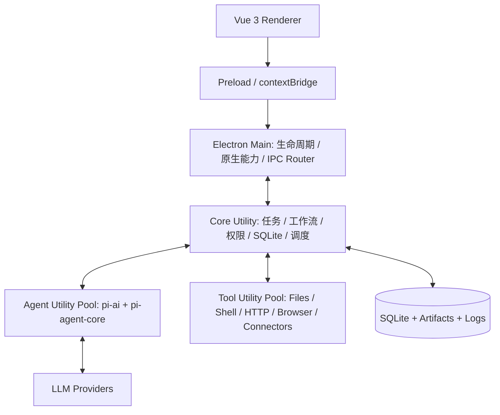

# 个人智能体桌面客户端技术架构与实施规范

- **版本**：v1.0
- **状态**：可执行架构基线
- **适用对象**：开发智能体、桌面端工程师、Agent Runtime 工程师
- **产品定位**：本地优先、可审批、可恢复、可审计的个人工作代理

> 核心结论：Electron 主进程保持最小；Core Utility 是本地业务后端和唯一数据库写入者；Agent Utility 运行 pi-ai/pi-agent-core；Tool Utility 隔离有副作用执行；pi-web-ui 只经 Adapter 复用。

## 架构图



## 1. 文档定位

本文件是一份“可交给开发智能体直接实施”的架构基线，适用于构建一个本地优先的个人智能体桌面客户端。产品目标不是做一个单纯聊天窗口，而是形成完整闭环：任务收集、任务分析、方案设计、人工审批、执行、验证、结果沉淀和主动任务。

本文件同时承担四个角色：

- 架构决策记录：明确进程边界、模块职责和不可突破的安全约束。
- 开发任务书：给出目录结构、核心接口、数据实体、阶段计划和验收标准。
- 智能体执行规范：约束开发智能体必须按阶段推进，不能绕过权限与持久化设计。
- 后续演进基线：首版以单用户、本地运行、可恢复执行为主，保留扩展连接器、多智能体和远程节点的空间。

## 2. 产品目标与范围

### 2.1 核心目标

系统应代理用户的大部分个人工作，但任何代理行为都必须是“可理解、可控制、可暂停、可回滚、可审计”的。首版重点支持：

1. 将自然语言需求转成结构化任务。
2. 生成可修改的执行方案和步骤依赖。
3. 按风险等级触发权限审批。
4. 运行模型、工具和连接器，并持续输出进度。
5. 保存会话、执行事件、产物、错误和恢复点。
6. 支持定时、周期和条件触发的主动任务。
7. 支持多个项目工作区，每个项目拥有独立上下文、权限范围和产物目录。

### 2.2 首版非目标

- 不建设多人协作服务器、组织权限和租户系统。
- 不允许“无限制全自动模式”。最高自动化级别仍须受项目范围、能力白名单和审计约束。
- 不在首版实现插件市场、远程执行集群或复杂向量数据库。
- 不把 Electron 主进程变成业务后端，也不让 Renderer 直接访问文件、数据库、密钥或模型 SDK。
- 不直接复制完整的 pi-coding-agent 产品逻辑；只复用底层模型和 Agent 能力，并按本产品任务模型重新组织。

## 3. 已确定的技术路线

| 层级 | 推荐技术 | 说明 |
|---|---|---|
| 桌面壳 | Electron + TypeScript | 负责跨平台窗口、系统能力、Utility Process 和打包 |
| 构建 | electron-vite + electron-builder（或同等成熟方案） | 需要支持 main、preload、renderer 和多个 utility entrypoint |
| 产品界面 | Vue 3 + TypeScript | 完整产品 UI，不以 pi-web-ui 作为应用框架 |
| UI 状态 | Pinia | 仅保存界面状态、查询缓存和短期交互状态 |
| UI 组件 | Naive UI + 自有设计系统 | 对话区以适配层复用外部组件 |
| Agent 模型层 | `@earendil-works/pi-ai` | 多模型供应商、流式输出、工具调用和使用量信息 |
| Agent 运行时 | `@earendil-works/pi-agent-core` | Agent 状态、消息、工具调用和事件流 |
| 对话组件 | `pi-web-ui` 仅经 Adapter 使用 | 固定版本、隔离依赖；必要时替换为自研 Vue 组件 |
| 本地数据库 | SQLite（WAL） | 单用户、本地优先、事务可靠、易备份 |
| SQLite 访问 | better-sqlite3 + Drizzle ORM | 运行于 Core Utility；打包时执行 Electron ABI rebuild |
| 校验 | Zod 或 TypeBox，项目内只选一种 | IPC、工具参数、数据库 JSON 字段统一校验 |
| 日志 | Pino + 结构化脱敏 | 主进程、Core、Agent、Tool 分通道记录 |
| 测试 | Vitest + Playwright + Electron E2E | 包含契约、恢复、安全策略和打包冒烟测试 |
| 工作区 | pnpm workspace | 共享类型与模块边界，锁定依赖版本 |

### 3.1 Pi 包名与版本规则

截至 2026 年 6 月，官方仓库已经使用 `@earendil-works` npm scope；旧文档和旧项目中仍可能出现 `@mariozechner`。开发时必须以同一个发布批次的 `pi-ai`、`pi-agent-core` 为准，写入 lockfile，不允许使用浮动的 `latest`。

`pi-web-ui` 当前维护状态与源码位置存在变化风险，因此只能放在 `packages/chat-ui-adapter` 中。业务层不得导入它的类型，数据库消息结构也不得采用它的私有数据模型。

## 4. 总体架构

系统使用多进程、命令驱动和事件回传架构。Renderer 只展示状态；Main 只管理桌面生命周期和安全桥；Core Utility 是唯一业务中枢；Agent Utility 负责模型循环；Tool Utility 负责有副作用的执行。

### 4.1 关键原则

- **Main 最小化**：Main 不承载任务编排、SQLite Repository 或模型调用。
- **Core 单写入者**：SQLite 只允许 Core Utility 写入，避免跨进程写锁与状态竞争。
- **Agent 可重启**：Agent 崩溃不能带走任务状态；会话、计划和事件必须在 Core 持久化。
- **工具不直连模型**：Agent 提出的工具调用必须先进入 Core 的策略引擎，再由 Tool Utility 执行。
- **事件可回放**：运行进度以 append-only `run_events` 保存，UI 断线后可按序号补拉。
- **UI 可替换**：聊天组件、模型提供商和具体工具都通过 Adapter/Registry 接入。

## 5. 进程模型与职责

### 5.1 Renderer Process

负责 Vue 3 界面，包括工作台、项目导航、任务中心、方案编辑器、审批中心、运行时间线、产物预览、主动任务和设置。Renderer 只通过 Preload 暴露的白名单 API 发出命令，不直接导入 `electron`、Node API、数据库驱动、pi SDK 或密钥模块。

Renderer 中不得持有真正的执行状态。页面刷新后，状态必须能够从 Core 的 Query API 和事件游标恢复。

### 5.2 Preload

使用 `contextIsolation: true`、`nodeIntegration: false`。只暴露语义化 API，例如 `task.create()`、`run.cancel()`、`approval.resolve()` 和 `events.subscribe()`；禁止暴露通用 `ipcRenderer.send(channel, payload)`。

Preload 必须在入站和出站两侧做协议版本、消息类型和 payload schema 校验。

### 5.3 Electron Main Process

职责仅包含：

- BrowserWindow、托盘、菜单、通知、深链和应用生命周期。
- `safeStorage`/系统 Keychain 的加解密入口。
- 启动、监控、心跳、重启 Core/Agent/Tool Utility。
- Renderer 与 Core 之间的 IPC 路由及 MessagePort 转移。
- 文件选择、系统打开、自动更新和自启动等原生能力。

Main 不得解释业务命令，不得直接决定工具权限，不得直接写业务数据库。

### 5.4 Core Utility Process

这是应用的“本地后端”，并且是唯一的业务事实来源，包含：

- Command Bus 与 Query Service。
- Task Orchestrator、Plan Service、Run Coordinator。
- Workflow State Machine。
- Policy Engine、Approval Service、Permission Grant Service。
- Persistent Scheduler、Trigger Evaluator、Outbox Dispatcher。
- SQLite Repository、Migration、事务和备份。
- Artifact Service、Audit Log、Event Store。
- Agent Worker 与 Tool Worker 的监督和路由。

Core 必须能够在 Agent 或 Tool 进程退出后，将运行标记为 `interrupted`/`blocked`，并从最近 checkpoint 继续或安全失败。

### 5.5 Agent Utility Pool

每个活跃运行使用一个隔离的 Agent Worker，或由受控 Worker Pool 复用。职责：

- 封装 `pi-ai` 模型选择、认证引用、流式请求和使用量。
- 封装 `pi-agent-core` Agent 生命周期、消息转换和工具定义。
- 构建系统提示、项目上下文、任务方案和短期记忆。
- 将 token delta、reasoning 状态、tool call、usage 和错误转成标准事件。
- 响应 abort、pause、resume、checkpoint 和 model-switch 命令。

Agent Worker 不直接访问 SQLite；所需状态由 Core 通过快照提供，新增事件由 Core 统一落库。

### 5.6 Tool Utility Pool

Tool Worker 运行文件、Shell、HTTP、浏览器自动化和第三方连接器。每个调用必须具备超时、AbortSignal、工作目录、环境变量白名单、输出上限和审计信息。

高风险工具建议采用“一次调用一个短生命周期 Worker”或独立沙箱进程。Shell、浏览器和不受信任扩展不得与 Agent Runtime 共进程。

## 6. 核心领域模型

系统围绕六个核心对象组织：

| 对象 | 定义 | 关键关系 |
|---|---|---|
| Project | 一个长期工作空间及其根目录、说明、策略和记忆边界 | 包含 Task、Session、Artifact |
| Task | 用户希望达成的目标，不等同于一次对话 | 拥有多个 Plan 版本和 Run |
| Plan | 对任务的结构化执行设计，可由用户编辑和审批 | 包含有依赖关系的 Step |
| Run | 对某个 Plan 版本的一次实际执行 | 产生 Event、ToolInvocation、Artifact |
| Session | Agent 对话与上下文状态 | 可关联 Task/Run，也可独立存在 |
| Schedule/Trigger | 主动任务的触发定义 | 触发新 Task 或 Run |

### 6.1 Task 状态机

标准状态：`draft`、`analyzing`、`design_ready`、`awaiting_approval`、`queued`、`running`、`paused`、`blocked`、`verifying`、`succeeded`、`failed`、`cancelled`、`archived`。

所有状态变化必须通过 Domain Service 完成，并追加 `task.status_changed` 事件。禁止在任意 Repository 调用中直接修改状态字段。

### 6.2 Plan Step

每个步骤至少包含：目标、类型、输入、依赖步骤、执行主体、预计副作用、权限需求、成功条件、重试策略和回滚说明。步骤类型建议为 `agent`、`tool`、`human_input`、`approval`、`verification`、`notification`。

### 6.3 自动化等级

| 等级 | 能力 | 默认策略 |
|---|---|---|
| L0 建议 | 只分析和给方案 | 不调用工具 |
| L1 只读 | 读取项目、检索、生成草稿 | 禁止写入和外部发送 |
| L2 受控执行 | 可在项目内写入，关键操作逐次审批 | 首版默认最高等级 |
| L3 项目自动 | 对明确项目范围内的低/中风险能力持久授权 | 仍需完整审计和撤销能力 |
| L4 主动执行 | 可由定时/条件触发运行 | 外部发送、删除、付费等仍强制审批 |

系统不提供“无边界全自动”等级。

## 7. 任务闭环设计

### 7.1 阶段一：任务输入

输入来源包括手动创建、对话转任务、拖入文件、剪贴板、日历/邮件连接器和定时触发。Core 将输入归一化为 `TaskDraft`，保留来源、原始文本、附件和幂等键。

### 7.2 阶段二：任务分析

产出结构化 `TaskAnalysis`：真实目标、已知信息、缺失信息、约束、风险、预计产物、是否需要外部系统、建议自动化等级和完成定义。分析结果必须可由用户编辑。

### 7.3 阶段三：任务设计

生成 `Plan` 和 `PlanStep[]`。设计阶段只描述执行，不立即产生副作用。计划版本使用乐观锁；用户修改后产生新版本，不覆盖已执行版本。

### 7.4 阶段四：审批

审批分为“计划级审批”和“调用级审批”。计划级确认整体方向；调用级针对具体文件、命令、域名、收件人或数据范围。审批 UI 必须展示参数、影响范围、差异预览、风险原因和授权有效期。

### 7.5 阶段五：执行

Run Coordinator 按 DAG 调度步骤。默认串行；只有无共享写入、无依赖且明确标记并行安全的步骤才允许并发。所有执行均使用 idempotency key，避免重启后重复发送或重复写入。

### 7.6 阶段六：验证

每个 Plan 必须包含完成标准。验证可以是测试命令、文件存在性、结构化 schema、人工确认或独立 Reviewer Agent。不能以“模型说完成了”作为唯一成功依据。

### 7.7 阶段七：结果沉淀

最终结果包括摘要、执行步骤、变更清单、产物链接、失败项、使用成本、审批记录和后续建议。结果写入 Task Result，并按策略生成可复用记忆。

## 8. IPC 与事件协议

### 8.1 协议要求

所有进程通信使用版本化 Envelope，并由共享 `packages/contracts` 定义。推荐结构：

```ts
interface Envelope<T> {
  protocolVersion: 1;
  id: string;
  type: string;
  timestamp: string;
  payload: T;
  context?: {
    projectId?: string;
    taskId?: string;
    runId?: string;
    sessionId?: string;
    correlationId?: string;
  };
}
```

Command 必须返回 accepted/rejected；长任务通过 Event 流更新，不让一个 IPC 请求保持数分钟。每个事件具有单调递增 `sequence`，Renderer 使用 `afterSequence` 补拉遗漏事件。

### 8.2 命令命名

- `project.create | update | archive | open`
- `task.create | analyze | savePlan | requestApproval | start | pause | resume | cancel | retry`
- `run.get | listEvents | createCheckpoint`
- `approval.resolve | revokeGrant`
- `session.create | prompt | steer | abort | switchModel`
- `schedule.create | enable | disable | runNow`
- `settings.get | update`

### 8.3 核心事件

- `task.created`、`task.status_changed`、`plan.version_created`
- `run.started`、`run.progress`、`run.blocked`、`run.completed`
- `agent.message_delta`、`agent.message_completed`、`agent.usage`
- `tool.call_requested`、`tool.execution_started`、`tool.execution_completed`
- `approval.requested`、`approval.resolved`
- `artifact.created`、`system.worker_restarted`、`system.error`

### 8.4 背压与大数据

IPC 中不传输大文件或超长日志。大内容先写 Artifact Store，事件只包含 artifactId、mimeType、size、hash 和预览。流式 token 事件由 Main/Core 合并节流，UI 更新建议 30–60 Hz 以下。

## 9. Pi 运行时适配

### 9.1 适配层结构

建立 `packages/pi-runtime-adapter`，对外只暴露产品自己的接口：

```ts
interface AgentRuntime {
  start(input: AgentRunInput): AsyncIterable<AgentRuntimeEvent>;
  steer(runId: string, message: UserMessage): Promise<void>;
  abort(runId: string): Promise<void>;
  checkpoint(runId: string): Promise<AgentCheckpoint>;
}
```

产品领域层不得直接引用 pi 的 Message、Tool 或 Event 类型。Adapter 负责双向转换，这样未来可以升级 pi、切换 SDK/RPC 模式或加入其他 Runtime。

### 9.2 SDK 优先，RPC 作为备用

Electron Utility 本身是 Node/TypeScript 环境，因此优先直接嵌入 SDK，减少额外子进程和 JSONL 编解码。RPC 模式保留为兼容路径，可用于独立进程隔离、调试或未来接入非 Node Runtime。

### 9.3 Tool 定义

给 Agent 暴露的工具只是“声明代理”，执行函数不能直接触碰操作系统。Agent Adapter 收到 tool call 后应产生 `tool.call_requested`，由 Core Policy Engine 评估，再转交 Tool Utility。工具结果随后以标准 `toolResult` 回填 Agent。

### 9.4 模型路由

Model Router 根据任务类型、上下文长度、工具能力、隐私、成本上限和用户偏好选择模型。模型切换只在 turn 边界进行，切换前保存 checkpoint。所有 provider credentials 只以 `secretRef` 传递，明文仅在需要请求时于受控进程解密。

### 9.5 上下文构建

每次模型调用的 Context Pack 由以下部分组成：系统规则、用户长期偏好、项目说明、当前任务分析、已批准计划、最近执行事件、相关产物摘要、可用工具及权限说明。不得把整个 SQLite 数据库或全部历史会话无差别塞入上下文。

## 10. Chat UI 适配策略

`pi-web-ui` 仅用于复用消息渲染、流式内容、tool call 展示或 composer 等局部能力。实现要求：

1. 所有导入集中在 `packages/chat-ui-adapter`。
2. Adapter 接收产品自有 `UiMessage`、`UiToolCall`、`UiArtifact`，内部再转换。
3. Vue 页面通过一个稳定组件 `<AgentConversation />` 使用，不接触外部组件事件名。
4. 固定确切版本并为关键渲染建立视觉回归测试。
5. 一旦外部包不兼容，可在不修改任务、会话和数据库模型的情况下替换。
6. 设置、模型管理、项目、任务、审批、运行和主动任务 UI 全部自研，不复用外部应用壳。

## 11. 工具系统

### 11.1 Tool Manifest

每个工具必须声明：`name`、`version`、`description`、输入 schema、输出 schema、capabilities、riskLevel、timeout、是否支持取消、是否幂等、可用平台和所需 secret refs。

### 11.2 首批内置工具

| 工具组 | 首版能力 | 默认风险 |
|---|---|---|
| Filesystem | list/read/search/write/patch/move | read=R0，write=R1/R2，delete=R3 |
| Shell | 执行允许的命令、收集 stdout/stderr | R2，危险命令 R3/拒绝 |
| HTTP | GET/受控请求、下载产物 | GET=R1，写请求=R2/R3 |
| Browser | 打开页面、读取、表单草稿 | 读取 R1，提交 R3 |
| Notification | 本地通知 | R0/R1 |
| Connector | Email/Calendar 等适配器 | read R1，write/send R3 |

### 11.3 执行限制

- 工作目录必须位于项目允许范围内，路径先 canonicalize 再授权。
- Shell 不接受一个“任意字符串后直接执行”的设计；参数化命令、命令解析和规则检查分离。
- 环境变量使用白名单，默认不继承完整 `process.env`。
- stdout/stderr 和文件读取设置大小上限，超限写入 Artifact。
- 网络工具执行域名、协议、端口和重定向检查。
- 每次执行保存参数摘要、授权来源、开始/结束时间、退出码、产物和错误分类。

## 12. 权限、审批与安全

Pi 底层本身不提供本产品需要的桌面权限审批体系，默认会继承启动进程的用户权限。因此权限层必须由本项目独立实现，且不能只靠提示词。

### 12.1 Capability 模型

建议能力集合：`fs.read`、`fs.write`、`fs.delete`、`shell.exec`、`network.request`、`browser.read`、`browser.submit`、`email.read`、`email.send`、`calendar.read`、`calendar.write`、`clipboard.read`、`notification.show`、`secret.use`。

授权由 capability + scope + constraint 组成。例如：

```json
{
  "capability": "fs.write",
  "scope": { "projectId": "p1", "path": "/workspace/p1/**" },
  "constraint": { "maxBytes": 1048576 },
  "decision": "allow",
  "expiresAt": "2026-06-29T00:00:00Z"
}
```

### 12.2 决策优先级

显式拒绝 > 系统强制规则 > 一次性审批 > 会话授权 > 项目授权 > 用户默认策略。任何授权都必须可撤销，并记录来源和过期时间。

### 12.3 强制人工确认操作

首版对以下操作始终要求确认：外部发送消息、创建/修改日历、删除或覆盖大量文件、访问新密钥、执行管理员命令、生产环境变更、产生费用、不可逆提交和任何超出项目范围的写入。

### 12.4 安全基线

- BrowserWindow 启用 sandbox、context isolation，关闭 Node integration。
- CSP 禁止任意远程脚本和 `eval`。
- 所有外链由 Main 验证后交给系统浏览器。
- 密钥使用系统安全存储加密；日志、事件和错误自动脱敏。
- 工具扩展默认视为不可信代码，安装与启用分开审批。
- Release 构建启用签名、自动更新签名验证和依赖审计。

## 13. 数据与持久化

### 13.1 数据库存储原则

Core Utility 独占 SQLite 连接，启用 WAL、foreign_keys、busy_timeout。所有 schema 变更通过 migration。关键业务写入使用事务，并同时写状态表和 outbox/event，避免“状态已变但事件丢失”。

### 13.2 建议表结构

| 表 | 关键字段 |
|---|---|
| projects | id, name, root_path, description, policy_json, status, created_at |
| tasks | id, project_id, title, goal, source, status, priority, risk_level, autonomy_level, due_at, version |
| task_analyses | id, task_id, version, analysis_json, created_by_run_id |
| plans | id, task_id, version, summary, status, approval_state, created_at |
| plan_steps | id, plan_id, sequence, type, title, input_json, depends_on_json, success_criteria_json, status |
| runs | id, task_id, plan_id, status, started_at, ended_at, checkpoint_json, error_code |
| run_events | id, run_id, sequence, event_type, payload_json, created_at |
| sessions | id, project_id, task_id, agent_profile_id, model_ref, status, snapshot_json |
| messages | id, session_id, sequence, role, content_json, usage_json, created_at |
| tool_invocations | id, run_id, step_id, tool_name, args_json, status, risk_level, approval_id, result_json |
| approvals | id, run_id, invocation_id, type, request_json, decision, decided_at, expires_at |
| permission_grants | id, capability, scope_json, constraint_json, decision, source, expires_at, revoked_at |
| artifacts | id, run_id, kind, path, mime_type, size, sha256, metadata_json |
| schedules | id, task_template_id, cron_or_time, timezone, enabled, next_run_at, missed_policy |
| triggers | id, schedule_id, type, config_json, cursor_json, last_checked_at |
| secrets_metadata | id, provider, label, encrypted_ref, last_used_at（不存明文） |
| audit_logs | id, actor, action, target_type, target_id, metadata_json, created_at |
| outbox_events | id, topic, payload_json, published_at, attempts |

### 13.3 Artifact Store

大文件、生成文档、截图、差异、命令输出和下载内容存储在应用数据目录下，按 project/run 分层。数据库只保存元数据和哈希。删除任务时先软删除，后台垃圾回收必须确认无引用且满足保留期。

### 13.4 搜索与记忆

首版使用 SQLite FTS5 对任务、消息摘要和 Artifact 文本建立全文索引。向量检索作为独立可选模块，不成为任务运行的必要依赖。

## 14. 主动任务与调度器

主动任务必须是“持久化调度”，而不是只在内存里 `setInterval`。

### 14.1 触发类型

- 一次性时间触发。
- Cron/周期触发。
- 应用启动、项目文件变化、邮件/日历轮询等条件触发。
- 前一个任务完成后的链式触发。

### 14.2 调度语义

- Core 持久化 `next_run_at`，启动后执行 missed-run reconciliation。
- 每次触发生成唯一 occurrenceId 和 idempotency key，语义为 at-least-once，但业务效果必须幂等。
- 支持 `skip`、`run_once_now`、`catch_up_limited` 等错过策略。
- 支持时区、静默时段、并发上限和同任务互斥锁。
- 默认主动任务只生成提醒、分析或草稿；外部发送和破坏性动作仍进入审批队列。

首版要求应用处于运行或托盘驻留状态。后续可增加 OS 登录自启动和独立 Helper Service，但不得假装应用完全退出后仍可执行。

## 15. 可恢复性与错误处理

### 15.1 Checkpoint

在以下节点保存 checkpoint：计划批准后、每个步骤开始前、每个步骤成功后、模型切换前、进入等待审批/用户输入前。Checkpoint 只保存可序列化状态和 artifact 引用，不保存活跃 socket 或进程句柄。

### 15.2 Worker 监督

Main 监控 Core；Core 监控 Agent/Tool。每个 Worker 提供 `ready`、`heartbeat`、`busy` 和 `shutdown_ack`。重启策略必须限制频率，连续崩溃后进入安全模式，不做无限重启。

### 15.3 错误分类

- `validation_error`：参数/schema 错误，不重试。
- `permission_denied`：等待授权或终止。
- `provider_rate_limit`：指数退避，可切换模型。
- `provider_timeout`：有限重试，保存当前 turn。
- `tool_timeout`：终止子进程并保留部分输出。
- `worker_crash`：从 checkpoint 恢复。
- `verification_failed`：回到修订计划或人工处理。

所有错误必须有面向用户的说明和面向日志的技术详情，禁止只显示“Something went wrong”。

## 16. 代码仓库结构

```text
personal-agent/
├─ apps/
│  └─ desktop/
│     ├─ src/main/                 # Electron Main
│     ├─ src/preload/              # contextBridge
│     ├─ src/renderer/             # Vue 3 产品 UI
│     └─ src/utilities/
│        ├─ core-entry.ts
│        ├─ agent-entry.ts
│        └─ tool-entry.ts
├─ packages/
│  ├─ contracts/                   # IPC、事件、DTO schema
│  ├─ domain/                      # Task/Plan/Run 状态机与规则
│  ├─ application/                 # Use cases、Command/Query handlers
│  ├─ infrastructure-sqlite/       # Drizzle、migration、repository
│  ├─ pi-runtime-adapter/          # pi-ai / pi-agent-core 隔离层
│  ├─ chat-ui-adapter/             # pi-web-ui 隔离层
│  ├─ tool-sdk/                    # Manifest、registry、执行协议
│  ├─ policy-engine/               # capability、scope、审批
│  ├─ scheduler/                   # 持久化调度和 trigger
│  └─ shared/                      # 日志、ID、错误、时间等
├─ tests/
│  ├─ contract/
│  ├─ integration/
│  ├─ recovery/
│  └─ e2e/
├─ docs/
│  ├─ adr/
│  ├─ protocols/
│  └─ security/
├─ package.json
├─ pnpm-workspace.yaml
└─ AGENTS.md
```

### 16.1 依赖方向

`domain` 不依赖 Electron、Vue、SQLite 或 pi；`application` 只依赖 domain 与抽象端口；infrastructure 和 adapters 实现端口；desktop 负责组合。建立 lint rule 或 dependency-cruiser 测试，禁止反向依赖。

## 17. 界面信息架构

首版建议采用以下一级导航：

1. **收件箱**：尚未归属项目或未分析的输入。
2. **任务中心**：按状态查看任务、方案和结果。
3. **项目**：项目上下文、文件、会话、任务、记忆和权限。
4. **运行中心**：当前运行、步骤、工具调用、日志、成本和产物。
5. **审批中心**：待审批、已批准、已拒绝和授权管理。
6. **主动任务**：定时、触发器、下一次运行和历史。
7. **智能体**：Agent Profile、模型路由、技能和工具。
8. **设置**：供应商、密钥、存储、隐私、更新和开发诊断。

任务详情页采用“目标 / 分析 / 方案 / 执行 / 结果”五段式，而不是把所有内容塞进聊天记录。聊天是交互入口，任务实体才是产品主线。

## 18. 观测、审计与成本

每个 Run 都需要统一 Timeline，将模型事件、工具调用、审批、用户输入、状态变化和产物合并展示。日志字段至少包含 process、level、timestamp、correlationId、projectId、taskId、runId、workerId 和 eventType。

模型 usage 记录 input/output/cache/reasoning tokens、预计费用、provider 和 model。成本限制支持单次 Run、每日和项目预算；达到软上限时提醒，达到硬上限时阻塞并要求审批。

日志必须默认脱敏：API key、Authorization header、cookie、密码、个人令牌和工具声明的 sensitive fields 不得写入普通日志。

## 19. 测试与质量门禁

### 19.1 必测内容

- Domain 状态机：非法跃迁必须失败。
- IPC Contract：所有 command/event 的正反序列化和版本兼容。
- Policy Engine：路径穿越、符号链接、域名重定向、过期授权和拒绝优先级。
- Run Recovery：Agent/Tool/Core 在不同节点崩溃后的状态恢复。
- Tool Timeout/Abort：子进程必须被真正终止，不能遗留孤儿进程。
- Database Migration：空库升级、旧版本升级和回滚备份。
- UI E2E：创建任务、生成方案、审批、执行、取消、恢复和查看产物。
- Packaging Smoke：Windows、macOS、Linux 至少验证启动、SQLite native module、Utility Process 和自动更新配置。

### 19.2 开发门禁

每个 PR 必须通过 typecheck、lint、unit、contract、integration 和最小 Electron smoke。安全边界相关修改必须附 ADR 或 threat-model 更新。

## 20. 分阶段实施计划

开发智能体必须严格按阶段交付，不允许第一轮就同时实现所有连接器和主动任务。

### Phase 0：工程骨架与进程通信

交付：pnpm workspace、Electron/Vue 启动、Preload 白名单、Core/Agent/Tool Utility 启动与健康检查、typed envelope、结构化日志。

验收：三个 Utility 可独立启动和优雅关闭；Renderer 能调用 `system.health` 并订阅事件；Renderer 无 Node 权限。

### Phase 1：项目、会话与基础 Agent

交付：Project、Session、消息流、模型设置、`pi-runtime-adapter`、最小对话 UI Adapter、SQLite migration。

验收：创建项目后可以流式对话；重启应用后会话可恢复；API key 不进入 Renderer 和日志。

### Phase 2：任务分析与方案设计

交付：Task/Analysis/Plan/Step、状态机、五段式任务页、计划版本和编辑。

验收：自然语言可生成结构化分析与 DAG 计划；用户修改后产生新版本；尚未批准的计划不会执行工具。

### Phase 3：工具、权限与审批

交付：Tool Manifest、Filesystem/受控 Shell、Policy Engine、Approval Center、Audit。

验收：所有写入都经过策略；拒绝后工具不执行；路径越界和危险命令被拦截；每次调用可追溯。

### Phase 4：运行编排、验证与恢复

交付：Run Coordinator、checkpoint、失败重试、verification step、artifact、worker restart。

验收：执行中杀死 Agent Worker，重启后可恢复或进入明确 blocked 状态；不重复已完成的有副作用步骤。

### Phase 5：主动任务

交付：持久化 scheduler、一次性/周期触发、托盘驻留、错过策略、通知。

验收：应用重启后 next_run 正确；重复触发不会产生重复外部效果；外部发送仍要求审批。

### Phase 6：记忆、连接器与高级能力

交付：FTS5 记忆检索、Email/Calendar/Browser Connector、Agent Profile、模型路由、可选 Reviewer Agent。

验收：每个连接器遵循相同 capability 与 audit 协议，不得绕过 Core。

## 21. 开发智能体执行约束

以下规则应复制到仓库根目录 `AGENTS.md`：

1. 开工前完整阅读本架构文档，先输出实施清单和当前 Phase，不得擅自改变进程边界。
2. 一次只实现一个 Phase；每个 Phase 完成后提交运行说明、测试结果、已知风险和下一阶段建议。
3. Renderer 禁止访问 Node、SQLite、pi SDK、文件系统和密钥。
4. Main 禁止承载领域业务和直接写业务数据库。
5. 只有 Core 可以改变 Task/Plan/Run 的持久化状态。
6. Tool Call 未通过 Policy Engine 不得执行；不允许用提示词代替权限判断。
7. 所有跨进程 payload 必须有 schema、protocolVersion 和 correlationId。
8. 不允许使用 `any` 绕过核心协议类型；不允许吞掉异常。
9. 所有外部依赖固定版本，升级 pi 或 Electron 时先建立兼容测试和 ADR。
10. 每完成一个垂直功能，必须补充单元测试、契约测试和最小 E2E。
11. 不实现本文“首版非目标”中的功能，除非用户明确新增需求。
12. 发现架构冲突时，先记录 ADR 和影响面，再提出修改，不可静默偏离。

## 22. 第一次交给开发智能体的启动指令

可将下面内容与本文件一起交给开发智能体：

> 你现在负责实现“个人智能体桌面客户端”。本架构文档是强约束基线。先完成 Phase 0，不要实现 Phase 1 之后的业务。请先检查当前目录，如果是空目录则初始化 pnpm workspace；如果已有项目则先审计现状并给出差异。你的第一轮交付必须包括：目录结构、依赖选择及固定版本、Electron Main/Preload/Renderer、Core/Agent/Tool 三个 Utility entrypoint、版本化 IPC Envelope、health command/event、结构化日志、优雅启动与关闭、基础测试和开发运行文档。必须保证 `nodeIntegration=false`、`contextIsolation=true`，Renderer 不能导入 Node API。完成后实际运行 typecheck、test 和桌面启动冒烟测试，并汇报命令输出摘要、改动文件、架构偏差和下一步。不要提前实现数据库业务表、完整聊天、工具执行或主动任务。

## 23. 架构验收清单

在进入正式功能开发前，至少确认以下事项：

- [ ] Renderer 中搜索不到直接 `electron`、`fs`、`child_process`、SQLite、pi runtime 导入。
- [ ] Main 只包含桌面能力、Worker Supervisor 和 IPC Router。
- [ ] Core 是唯一数据库写入者和任务状态变更入口。
- [ ] Agent/Tool Worker 均可单独崩溃，不导致 UI 和数据库一起退出。
- [ ] Tool 调用链中明确存在 schema validation、policy evaluation、approval、execution、audit。
- [ ] 所有运行事件可持久化并按 sequence 回放。
- [ ] `pi-web-ui` 与业务类型隔离，移除该包不会破坏领域层。
- [ ] 密钥从不进入 Renderer、普通日志或任务上下文快照。
- [ ] 主动任务使用持久化 next_run 和幂等键。
- [ ] 打包产物可加载 SQLite native module 并启动 Utility Process。

## 24. 主要风险与应对

| 风险 | 影响 | 应对 |
|---|---|---|
| pi 包快速演进、scope/接口变化 | 构建失败或类型不兼容 | 固定同批版本；Adapter 隔离；升级前跑 contract tests |
| pi-web-ui 维护状态变化 | UI 无法升级或依赖冲突 | 只复用局部组件；稳定 UiMessage 模型；可随时替换 |
| Electron 原生模块打包 | SQLite 在发布版加载失败 | CI 执行 ABI rebuild；三平台 package smoke |
| Agent 自主调用高风险工具 | 数据破坏或隐私泄露 | 确定性 Policy Engine、人工审批、范围授权、审计 |
| 主动任务重复运行 | 重复发送或重复修改 | occurrenceId、idempotency key、事务 outbox |
| 多进程事件丢失 | UI 状态与真实运行不一致 | append-only event、sequence、补拉与快照 |
| 长会话上下文膨胀 | 成本和质量下降 | Context Pack、摘要、Artifact 引用、token budget |
| Worker 卡死或 Provider 无响应 | 任务长期无反馈 | timeout、heartbeat、abort、checkpoint、有限重启 |

## 25. 参考依据

- Electron Utility Process API：Utility Process 在 Node.js 环境运行，支持 MessagePort，适合隔离易崩溃、CPU 密集或不可信服务。
- Electron Process Model：Renderer 不应默认拥有 Node 权限，应通过 Preload/contextBridge 暴露受控 API。
- Pi 官方仓库：`pi-ai` 提供统一 LLM API；`pi-agent-core` 提供 Agent runtime、工具调用和状态管理。
- Pi SDK/RPC 文档：Node/TypeScript 应用可直接嵌入 SDK；RPC 提供 JSONL 的 headless 集成方式。
- Pi 官方说明：Pi 不内置本产品所需的文件、进程、网络和凭证权限限制，因此本架构将 Policy/Approval 设为独立核心模块。

参考链接：

1. https://www.electronjs.org/docs/latest/api/utility-process
2. https://www.electronjs.org/docs/latest/tutorial/process-model
3. https://github.com/earendil-works/pi
4. https://github.com/earendil-works/pi/blob/main/packages/ai/README.md
5. https://github.com/earendil-works/pi/blob/main/packages/coding-agent/docs/sdk.md
6. https://github.com/earendil-works/pi/blob/main/packages/coding-agent/docs/rpc.md
7. https://github.com/earendil-works/pi/issues/4966
